# 프롬프트 평가에서 에이전트 평가로: 고정 fixture와 stateful simulator를 함께 쓰기까지

**고정된 문맥에서 올바른 plan을 생성하는 모델을 평가하던 방식은, 모델과 하네스가 환경과 상호작용하는 전체 실행을 평가하는 방식으로 확장되어야 한다.**

- **출발점:** 2025년 `llm-train`과 `plan-llm`의 prompt·plan 평가.
- **현재 도달점:** AIC 요청·응답 계약을 대상으로 한 AES의 fixture replay와 제한적인 capability continuation.
- **다음 방향:** state와 tool output을 제공하는 simulator를 추가하고, replay와 stateful episode를 함께 운영하는 하이브리드 AES.
- **서술 기준:** Phase 1~4는 로컬 코드·Git 이력을 바탕으로 한 분석이다. Phase 5~6은 **아직 구현 완료를 주장하지 않는 설계 제안**이다.
- **문서 상태:** 포스팅 초안이다. `docs/`는 사이트 빌드에서 제외되며 현재 글 목록에 노출되지 않는다.

## 평가가 복잡해진 이유

**평가 단위가 모델의 한 번의 출력에서, 모델과 하네스가 만드는 실행 과정과 결과로 바뀌었다.**

- [Anthropic agent eval 정리](../data/posts/2026-08-31-demystifying-agent-evals-korean.md)의 구분에 따라 **agent harness**와 **evaluation harness**를 구분한다.
- **Agent harness:** 모델 입력 구성, tool 호출·결과 전달, 상태 유지, 재시도·중단 등 실행을 조율한다.
- **Evaluation harness:** task와 실행 환경을 준비하고, agent를 실행하고, 기록·결과를 grader로 판정한다.
- 2025년에도 multi-turn 문맥, 여러 step, service decoder가 있었다. 당시 시스템 전체에 orchestration이 없었다는 뜻은 아니다.
- 여기서 **single-turn/component 평가**는 고정된 입력에 대한 모델 예측을 평가 단위로 삼는다는 뜻이다. 실제 예측과 도구 결과가 다음 환경을 만드는 전체 episode 평가와 구분한다.
- 초기 평가가 상대적으로 단순했던 것은 정답 판정이 항상 쉬워서가 아니라, **평가기가 동적인 환경과 실행 수명을 소유할 필요가 적었기 때문**이다.

## 여섯 개 phase

| Phase | 시기·상태 | 평가 질문 | 다음 단계가 필요한 이유 |
| --- | --- | --- | --- |
| 1. 고정 prompt의 plan 평가 | 2025년 기본 구조 | 이 문맥에서 다음 출력을 맞혔는가? | 올바른 출력과 실제 작업 성공은 다름 |
| 2. 판정과 분석의 확장 | 2025년 중·후반까지 확장 | 표현과 plan 구조가 달라도 올바른 예측인가? | 채점 개선만으로 실제 오류 전파를 볼 수 없음 |
| 3. 하네스로 평가 대상 확대 | 2026년 AIC 변화 | 모델과 하네스가 함께 어떤 행동을 했는가? | 검색·실행·상태 전달의 실패를 분리해야 함 |
| 4. AES의 계약 기반 replay | 분석한 현재 구현 | 같은 문맥에서 판단과 회귀를 재현할 수 있는가? | fixture는 실제 action에 반응하는 환경이 아님 |
| 5. State와 observation의 실행 | 향후 설계 제안 | 실제 상태 전이를 거쳐 목표를 달성하는가? | simulator의 비용·충실도까지 관리해야 함 |
| 6. 하이브리드 AES 운영 | 목표 운영 형태 | 위험에 맞는 모드로 평가하고 실패를 다시 자산화하는가? | 두 모드의 점수와 실행 의미를 보존해야 함 |

- Phase는 공식 로드맵이나 엄격하게 분리된 출시 시점이 아니다. **문제 → 대응 → 남은 한계**를 설명하기 위한 구성이다.
- Phase 1~2의 기술은 겹쳐 존재했다. 구조 비교와 문장 유사도가 하반기에 처음 생겼다는 의미가 아니다.
- AIC의 세부 구현 변화는 [runtime 7단계 부록](aic-runtime-history.md)에 별도로 보존했다.

## Phase 1 — 고정된 입력에서 올바른 plan을 생성하는가

**고정된 prompt와 ground truth를 준비하면 모델의 다음 예측을 분리해서 비교할 수 있었다.**

- **당시의 질문:** 발화·문맥이 주어졌을 때 올바른 agent, 함수, 파라미터, plan을 생성하는가?
- **구성:** `llm-train`이 TC를 읽어 WorldState와 prompt/target을 구성하고, 모델의 예측을 파일로 남겨 사후 평가한다.
- **서비스와의 연결:** prompt builder와 parser는 `plan-llm`, WorldState와 schema 표현은 `nl-lib`의 구조를 활용한다.
- **비교 대상:** 모델·LoRA·학습 checkpoint와 prompt의 변경.
- **상대적으로 단순한 경계:** 입력과 기대 결과를 미리 정할 수 있고, 평가기가 실제 도구 실행과 상태 변화를 끝까지 관리하지 않아도 된다.

### 블록 다이어그램

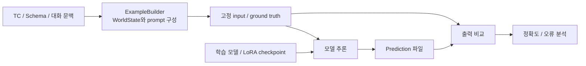

### 시퀀스 다이어그램

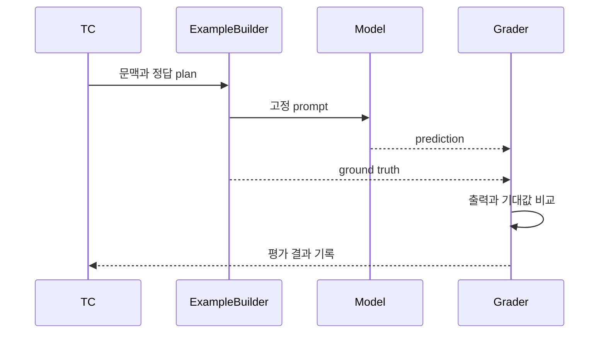

- **드러난 한계:** 올바른 tool call을 생성했다고 실제 작업이 성공한 것은 아니다.
- **예시:** 타이머 생성 함수를 올바르게 출력했어도, 중복 생성·실패 후 복구·최종 활성 상태는 그 출력만으로 확인할 수 없다. 이후 예시도 평가 경계를 설명하기 위한 가상 사례다.
- **다음 단계:** 복잡한 plan과 다양한 표현을 잘못 판정하지 않도록 채점과 분석을 정교하게 만든다.

## Phase 2 — 판정을 정교하게 만들어도 실행 전체는 보이지 않았다

**출력을 더 정확하게 판정하는 것과, 실제 행동이 이어진 episode의 성공을 확인하는 것은 다른 문제였다.**

- **문제:** full plan과 중첩 함수가 복잡해지고, 의미가 같아도 문자열이 다른 출력이 생긴다.
- **발전:** 함수·파라미터 재귀 비교, 의미 유사도·양방향 entailment, LLM judge, step·turn·conversation 집계, 평가 결과 간 회귀 비교.
- **연도 내 변화:** 7월 SA full-plan, 8월 DA full-plan 관련 변경과 10월 LLM judge 통합을 확인했다. 문장 유사도·entailment와 일부 다단계 집계는 그 이전에도 존재했다.
- **핵심 한계:** 정교한 grader를 추가해도 입력을 정답 문맥으로 복원하면 실제 실패의 전파와 복구 과정은 측정하지 못한다.

### 블록 다이어그램

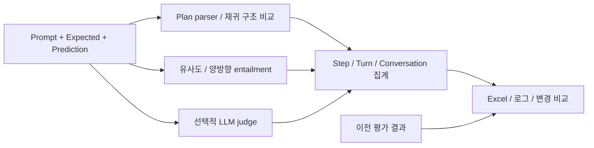

### 시퀀스 다이어그램: 정답 prefix를 사용하는 평가

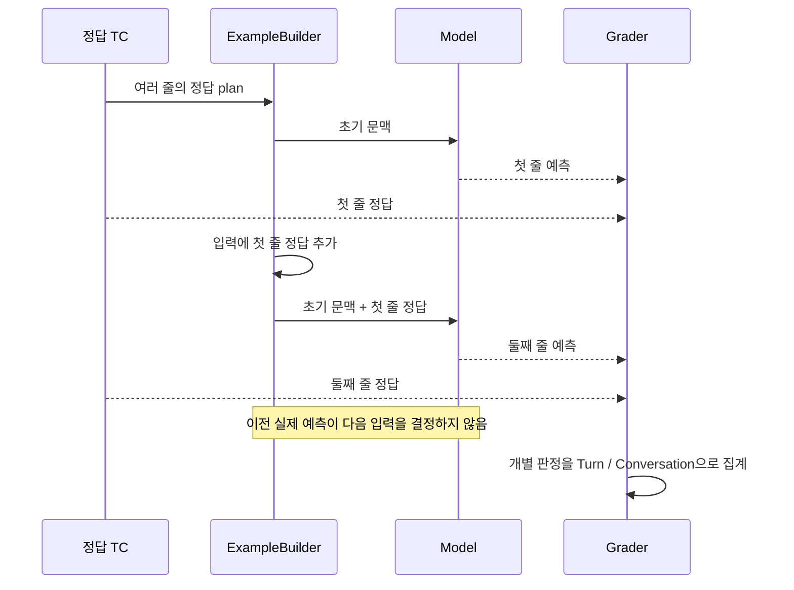

| 구분 | 확인한 당시 동작 | 점수 해석의 범위 |
| --- | --- | --- |
| 평가용 plan 분할 | `clone_prompts_by_split_target()`이 이전 정답 줄을 다음 prompt에 추가 | 정답 문맥에서 다음 예측을 평가 |
| Turn / Conversation 집계 | 여러 판정에 `all()`을 적용하는 집계 존재 | 실제 연속 실행의 성공률과 같지 않음 |
| SA full-plan 배치 클라이언트 | 추출된 agent 목록에 `expectedAgent`가 포함되는지 판정 | 전체 plan의 모든 인자·순서·실행 효과를 보장하지 않음 |
| 결과 간 비교 | 추가·삭제·수정된 TC와 공통 TC를 구분 | 데이터 모수 변화와 모델 결과 변화를 분리하려는 장치 |

- **전제:** 정답 prefix 분할은 해당 평가 경로의 동작이며 모든 prompt에 적용되지 않는다. NLG·grounding·summarization 등은 제외된다.
- **CI와 모델 평가의 구분:** 2025년 말 `plan-llm`의 기본 pytest 설정은 IES·plan·service 테스트 디렉터리 일부를 제외한다. CI 통과를 실제 모델의 전체 업무 성공으로 해석할 수 없다.
- **다음 단계:** 모델 출력 외에 실행을 조율하는 하네스까지 평가 대상으로 포함해야 한다.

## Phase 3 — 하네스가 등장하면서 평가 대상 자체가 달라졌다

**AIC에서는 같은 발화도 검색 결과, 중간 tool output, snapshot과 tier 선택에 따라 이후 실행이 달라진다.**

- **변화:** 자체 planner loop에서 Deep Agents 기반 runtime으로 이동하고, Fast/Deep routing, CDS discovery, skill 로딩, tool handoff와 snapshot 복원이 추가된다.
- **호출 경계의 변화:** 5월 초 내부 Fast→Deep fallback이 5월 21일 client 재호출 계약으로 바뀌고, 7월에는 snapshot이 client를 통해 왕복한다.
- **새로운 질문:** 최종 출력이 틀렸을 때 모델 선택, capability 검색, 도구 결과, 상태 전달 중 어디가 원인인가?
- **관찰 대상:** 한 번의 텍스트 출력에 더해 호출 과정, messages, tool 결과, snapshot과 종료 조건이 중요해진다.

### 블록 다이어그램

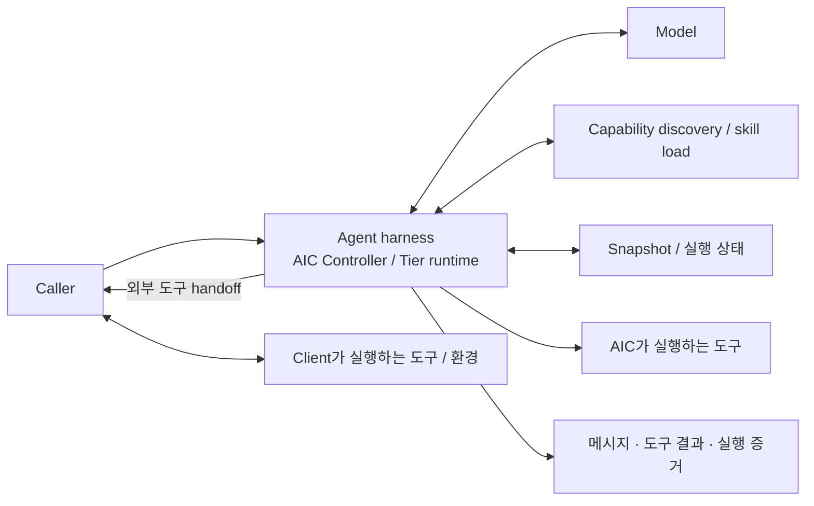

### 시퀀스 다이어그램

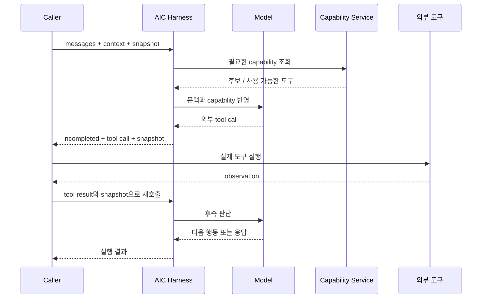

- **복잡해진 이유:** 한 사용자 요청, 한 API 호출, 한 모델 생성, 한 평가 step이 더 이상 같은 단위가 아니다.
- **필요한 구분:** 무엇을 했는지 남기는 **transcript**와, 그 행동으로 실제 무엇이 바뀌었는지 보여주는 **outcome**을 구분해야 한다.
- **근거의 범위:** 모든 AIC 도구가 위 외부 handoff 경로를 따르지는 않는다. Built-in 도구는 AIC가 실행한다.
- **다음 단계:** 먼저 요청·응답 계약을 고정하고, 동일한 조건에서 판단을 재현할 평가 체계를 만든다.

## Phase 4 — AES로 실행 계약을 고정하고 판단을 재현한다

**현재 AES는 고정된 문맥에서의 판단과 회귀를 재현하고, 일부 capability 절차를 실제 상태로 이어 실행한다.**

- **해결한 문제:** 잘못된 TC와 runtime 실패를 구분하고, 서비스 응답 표현을 통일하며, 비교 가능한 실행 근거를 남긴다.
- **구성:** canonical schema와 preflight, 기대 이력 projection, Step·Path 실행, 응답 정규화, deterministic scoring, JSON artifact와 checkpoint.
- **하네스 대응:** TC가 다른 행동을 기대하는데 capability-only 응답이 오면, AIC가 해결한 tool message와 snapshot으로 제한적으로 재호출한다.
- **역사적 위치:** AES는 2026년 5월부터 존재했다. 8월 AIC의 평가 자산 제거는 기존 AES로 평가 책임을 모으는 변경이다.

### 블록 다이어그램

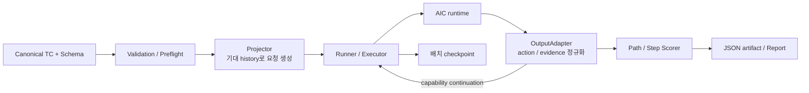

### 시퀀스 다이어그램

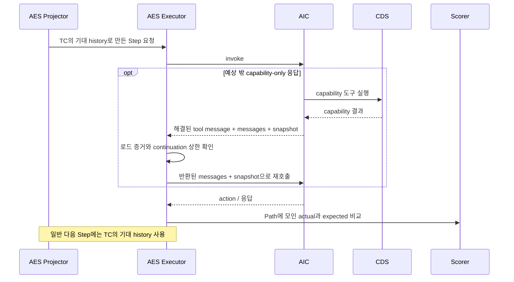

| 현재 AES가 잘 답하는 질문 | 현재 점수만으로 답하기 어려운 질문 |
| --- | --- |
| 주어진 문맥에서 올바른 action을 선택하는가? | 실제 이전 오답이 누적되어도 목표에 도달하는가? |
| 기대 도구와 인자, 설정한 skill/tier 조건이 맞는가? | 실제 환경 상태가 기대대로 변경됐는가? |
| 구조화된 CDS 증거상 후보가 있었는가? | client-owned 도구의 실제 실행과 부작용이 올바른가? |
| 동일 TC에서 회귀가 생겼는가? | 예상하지 못한 observation에서 올바르게 복구하는가? |

- **평가 경계:** 일반 다음 step과 turn의 history는 기대값으로 만들어진다. 모든 실제 tool output을 끝까지 이어 가는 episode 실행은 아니다.
- **Continuation 범위:** 모든 built-in·외부 도구를 자동으로 이어 주는 기능이 아니다. 예상 밖 capability-only 응답을 제한적으로 처리한다.
- **점수 의미:** 현재 executor는 후보 Path별로 별도 실행할 수 있다. 그 점수를 실제 trajectory 하나의 성공률로 바꾸어 부르면 안 된다.
- **남은 문제:** 환경이 바뀌었을 때 fixture가 낡고, 허용 가능한 경로가 늘면 기대 경로 관리가 비싸지며, 상태 변화와 recovery가 평가 밖에 남는다.
- **다음 단계:** simulator가 실제 action에 반응해 다음 observation을 만들도록 한다.

## Phase 5 — Simulator가 state와 tool output을 제공한다

**향후 설계 제안: agent의 실제 행동이 다음 state와 observation을 결정하는 episode 평가를 추가한다.**

- **입력 계약:** 고정 tool output의 나열 대신 초기 state, 사용자 요청, 필요 시 사용자 응답 정책, 성공 조건과 금지된 부작용을 정의한다.
- **실행 책임:** simulator가 맡은 도구는 실제 action에 따라 상태를 전이시키고 그 결과를 tool output으로 반환한다.
- **재호출:** episode driver가 실제 observation을 AIC의 continuation 계약에 맞게 전달하고 종료·오류·budget 소진까지 실행한다.
- **채점:** 최종 상태뿐 아니라 필수 중간 조건, 부작용, 실패 후 복구, 호출 수·시간·비용을 구분해 기록한다.
- **범위:** 상태·도구 규칙이 명확한 결정적 simulator부터 시작한다. LLM 기반 사용자 simulator는 대화 분기가 필요한 task에 별도로 추가할 수 있다.

### 블록 다이어그램 — 제안 구조

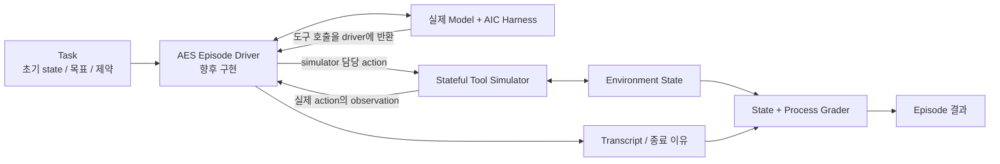

### 시퀀스 다이어그램 — 제안 구조

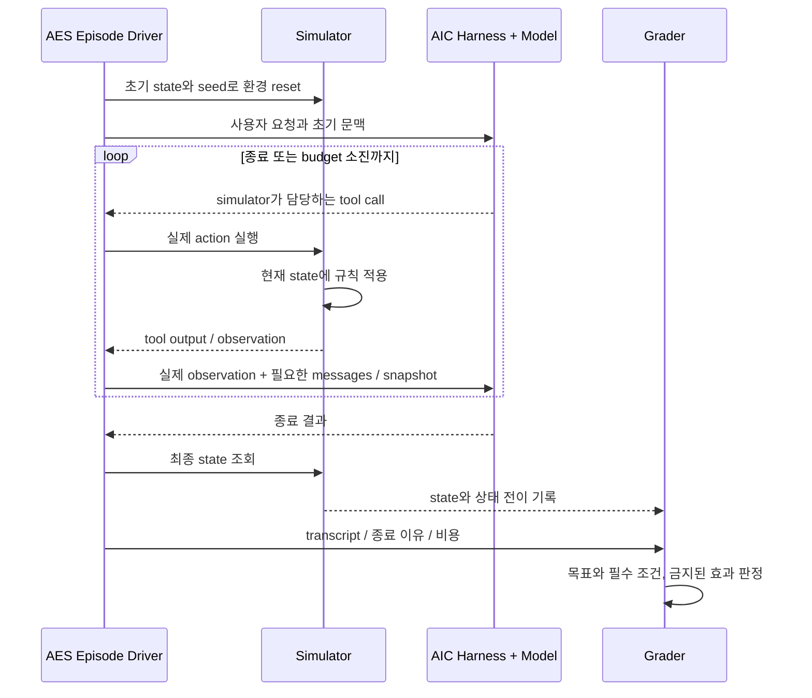

- **예시:** “10분 타이머 하나 만들기”의 성공 조건은 특정 문자열 출력보다, 타이머가 정확히 하나 생성되고 지속시간과 활성 상태가 맞는지로 정의할 수 있다.
- **Recovery 사례:** 생성 요청이 처리된 뒤 응답만 유실되는 상황에서 재시도가 중복 생성으로 이어지는지도 상태로 확인한다. 이 동작은 실제 도구 계약에 맞게 simulator에 정의해야 한다.
- **구현상 주의:** 현재 AES executor에 simulator를 붙이기만 하면 완성되는 것은 아니다. 실제 history를 유지하는 driver, tool 실행 경계와 episode 종료 계약이 필요하다.
- **실행 경계:** AIC 내부에서 직접 실행되는 built-in 도구까지 모사하려면 해당 runtime의 tool backend 주입 또는 별도 sandbox 연동이 필요하다. 외부 handoff만 가로채서는 전체 도구를 통제할 수 없다.
- **Simulator 검증:** 실제 tool 계약과 상태 전이의 일치, reset 격리, 시간·seed 제어, 실패 주입 규칙을 검증한다. simulator가 틀리면 agent 점수도 왜곡된다.
- **다음 단계:** 비용과 발견하는 실패 종류가 다른 replay·episode 평가를 역할에 맞게 함께 운영한다.

## Phase 6 — Fixture와 simulator가 서로 보완하는 하이브리드 AES

**목표 운영 형태: 빠르고 재현 가능한 판단 평가와, 실제 상태 전이를 확인하는 episode 평가를 함께 유지한다.**

### 블록 다이어그램 — 제안 구조

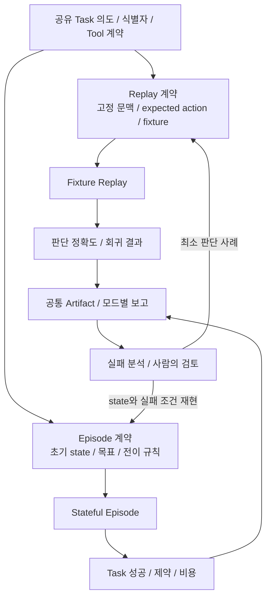

### 시퀀스 다이어그램 — 제안 운영 흐름

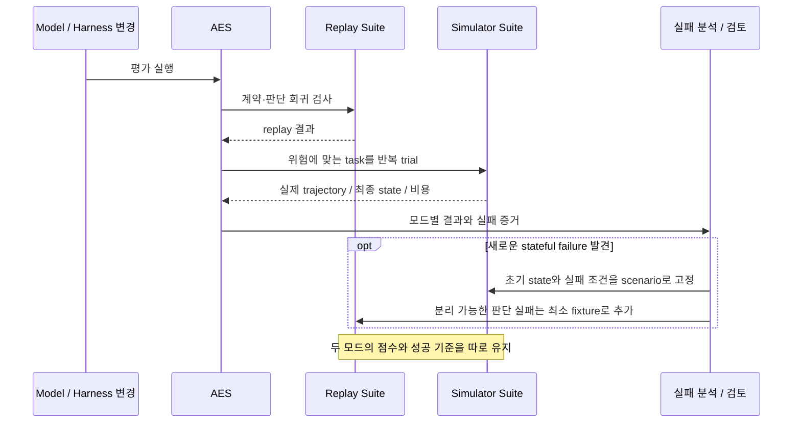

| 기준 | Fixture replay | Stateful episode |
| --- | --- | --- |
| 질문 | 주어진 문맥에서 다음 판단이 맞는가? | 실제 행동을 이어 목표 상태에 도달하는가? |
| Tool output 소유자 | TC에 기록된 fixture | 실제 action과 현재 state를 처리하는 환경 |
| 다음 입력 | 기대 history로 재구성한 문맥 | 실제 transcript와 observation |
| 성공 기준 | 정의한 action·tool·skill 등 판단 계약 | 목표 state + 필수 조건 + 금지 효과 |
| 주요 용도 | 빠른 회귀, 특정 경계와 edge case | 상태 변화, recovery, 여러 허용 경로 |
| 주요 비용 | fixture 작성·갱신과 경로 관리 | simulator 구현·검증, 실행 시간과 반복 trial |
| 보고 지표 | decision/replay accuracy | episode success, 제약 위반, 비용·일관성 |

- **공유할 것:** task 식별자, tool 계약, model·harness·dataset revision, 실행 기록과 보고 체계.
- **모드별로 둘 것:** observation의 생성 주체, 초기화 방식, 실행 종료 조건, grader와 성공의 의미. 하나의 기존 TC가 자동으로 두 모드 모두의 계약이 되지는 않는다.
- **버전과 재현성:** episode 결과에는 simulator revision, 초기 state, seed·시간 조건, budget도 남긴다.
- **반복 실행:** trial 수와 성공·오류의 분포를 보존한다. 평균 한 숫자로 환경 오류와 agent 실패를 합치지 않는다.
- **복수 정답:** 한 trial에서 생성된 실제 trajectory 하나를 여러 허용 outcome과 비교한다. 기대 경로마다 다시 실행해 성공 기회를 늘리지 않는다.
- **실패 환류:** 복구·상태 전이 문제는 episode scenario로 보존하고, 그 안의 특정 판단 오류는 필요할 때 최소 fixture로 분리한다.
- **기존 자산 활용:** golden-history replay는 폐기 대상이 아니라 좁고 빠른 회귀 검사로 계속 사용한다.

## 무엇이 달라졌는지 확인할 기준

| 단계 | 성과를 확인할 질문 |
| --- | --- |
| 현재 replay 유지 | 같은 실행 조건에서 알려진 판단 회귀를 재현하고 원인을 분리하는가? |
| Simulator 도입 | replay에서는 통과했지만 실제 state가 틀리는 실패를 발견하는가? |
| Tool 환경 검증 | simulator의 전이와 observation이 실제 도구 계약과 일치하는가? |
| 하이브리드 운영 | episode 실패를 재현 가능한 scenario와 필요한 fixture로 환류하는가? |
| 결과 비교 | 모드·revision·초기 조건·trial 수를 고정하거나 차이를 명시하고 비교하는가? |

**평가의 발전은 정답 비교를 버리는 과정이 아니라, 정답 비교가 답할 수 있는 질문을 명확히 하고 실제 실행이 필요한 질문에 환경과 상태 검증을 추가하는 과정이다.**

## 분석 범위와 근거

- **로컬 분석일:** 2026-09-20~21. 평가 방식은 로컬 소스와 Git 이력으로 조사했다. 모델·서비스·simulator를 실행해 성능 수치를 검증한 글은 아니다.
- **2025년 기준:** `llm-train`의 `8880d7ca`(2025-12-27), `plan-llm`의 `cbe8e164`(2025-12-31), 초기 구조는 2월 `6fa05d77`도 확인했다.
- **현재 구현 기준:** AIC `fde590ec`(2026-08-31), AES `68093a5e2b`(2026-08-27). ‘현재’는 이 분석 기준이며 이후 배포 상태를 뜻하지 않는다.
- **해석의 경계:** 한계와 다음 설계의 연결은 코드에 근거한 분석이다. 모든 변경이 당시 그 이유로 추진되었다거나 과거 코드를 그대로 이식했다고 단정하지 않는다.
- **접근 조건:** 아래 구현 링크는 분석 커밋에 고정한 GitHub Enterprise 링크이며 저장소 접근 권한이 필요하다.

### 2025년 평가 구현

- [Prompt와 WorldState 구성](https://github.ecodesamsung.com/bixby-platform/llm-train/blob/8880d7ca707db1a4d65729b1dd92d78822c7a4cc/data_builder/example_builder.py)
- [정답 prefix를 다음 평가 입력에 붙이는 구현](https://github.ecodesamsung.com/bixby-platform/llm-train/blob/8880d7ca707db1a4d65729b1dd92d78822c7a4cc/data_builder/example_builder.py#L411)
- [예측과 ground truth 기록](https://github.ecodesamsung.com/bixby-platform/llm-train/blob/8880d7ca707db1a4d65729b1dd92d78822c7a4cc/inference/prompt_inference.py#L78)
- [함수·파라미터 비교](https://github.ecodesamsung.com/bixby-platform/llm-train/blob/8880d7ca707db1a4d65729b1dd92d78822c7a4cc/evaluation/eval_scorer.py#L157)
- [의미 유사도와 entailment](https://github.ecodesamsung.com/bixby-platform/llm-train/blob/8880d7ca707db1a4d65729b1dd92d78822c7a4cc/evaluation/eval_nlg.py)
- [LLM judge](https://github.ecodesamsung.com/bixby-platform/llm-train/blob/8880d7ca707db1a4d65729b1dd92d78822c7a4cc/evaluation/eval_llm_judge.py)
- [추가·삭제·변경된 TC와 공통 결과 비교](https://github.ecodesamsung.com/bixby-platform/llm-train/blob/8880d7ca707db1a4d65729b1dd92d78822c7a4cc/evaluation/performance/eval_comparison.py)
- [SA full-plan 배치의 agent 포함 판정](https://github.ecodesamsung.com/bixby-platform/plan-llm/blob/cbe8e1646c748152adaac6f65feb98391b0e857a/tests/test_clients/sa_test_client.py#L134)
- [당시 pytest 실행 범위](https://github.ecodesamsung.com/bixby-platform/plan-llm/blob/cbe8e1646c748152adaac6f65feb98391b0e857a/pyproject.toml)

### 현재 AES와 AIC

- [AES의 기대 history projection](https://github.ecodesamsung.com/bixby-platform/agentic-evaluation-service/blob/68093a5e2b0e498ca62d56e3fe10db51ded026fc/evaluator/projection/test-case-projector.ts#L127)
- [AES Step 실행과 capability continuation](https://github.ecodesamsung.com/bixby-platform/agentic-evaluation-service/blob/68093a5e2b0e498ca62d56e3fe10db51ded026fc/evaluator/execution/aic-test-case-executor.ts#L90)
- [AIC Controller의 실행 경계](https://github.ecodesamsung.com/bixby-platform/agentic-intelligence-core/blob/fde590ecc4e56fe1c04d58ee538f28ddcba137be/core/csa/cognitive-supervisor-agent-controller.ts#L76)
- [AIC 7단계 구현 이력과 기존 블록·시퀀스 다이어그램 14개](aic-runtime-history.md)

### 연결해서 읽을 기존 글

- [Anthropic agent eval 정리](../data/posts/2026-08-31-demystifying-agent-evals-korean.md)
- [TC 기반 평가와 simulator 기반 평가](../data/posts/2026-08-31-test-case-vs-simulator-evaluation.md)
- [Hybrid Evaluation Architecture](../data/posts/2026-08-31-hybrid-agent-evaluation-strategy.md)
