# AIC의 진화와 현재 evaluator의 구조

분석일: 2026-09-20. 로컬 Git 이력과 해당 커밋의 소스를 읽어 재구성했다. Phase는 저장소의 공식 로드맵이 아니라 **실행 책임과 요청·응답 계약이 바뀐 경계**를 기준으로 나눈 것이다.

- AIC: `main`, `fde590ecc4e56fe1c04d58ee538f28ddcba137be` — 2026-08-31.
- AES: `68093a5e2b` — 2026-08-27.
- 원격 fetch와 배포 환경 검증은 하지 않았다. 여기서 ‘현재’는 위 로컬 checkout을 뜻한다.
- 날짜는 Git 로그에 기록된 날짜를 기준으로 한다. 모든 기능 변경을 나열하지 않고 evaluator의 설계에 영향을 주는 흐름에 집중했다.
- 아래 ‘평가에 미친 영향’은 별도 표시가 없는 한 코드의 관계를 해석한 것이며, 당시 개발자의 의도를 단정한 것이 아니다.

핵심은 AIC가 **자체 planner loop → 교체 가능한 agent runtime → Fast/Deep routing → client round trip → 동적 capability와 상태 복원**으로 확장되었다는 점이다. 현재 AES는 그 경계를 대상으로 입력을 재현하고, 구조화된 행동을 비교하며, capability continuation만 제한적으로 이어 실행한다.

## Phase 개요

| Phase | 기간 | 중심 변화 | 평가에서 중요해진 것 |
| --- | --- | --- | --- |
| 1 | 02-19 ~ 04-09 | 직접 만든 Subtask/Tool planner loop | 최종 답뿐 아니라 계획·도구 실행 이력 |
| 2 | 04-10 ~ 05-07 | Deep Agents + Adapter + skills + streaming | 외부 요청/응답 계약과 tool-call handoff |
| 3 | 05-08 ~ 05-20 | FastPlanner 먼저, 실패 시 내부 Deep fallback | 행동 선택과 tier 판단의 분리 |
| 4 | 05-21 ~ 06-15 | deliberate, incompleted, client 재호출, 도구 실행 주체 분리 | Turn/Step, 기대 이력 재생, transport 정규화 |
| 5 | 06-16 ~ 07-05 | CDS discovery, 확장 capability, ToolSpec/Runnable 분리 | 검색 실패와 행동 선택 실패의 구분 |
| 6 | 07-06 ~ 08-10 | snapshot 왕복, fetch capability, debug evidence | 상태 보존, skill 로드 증거, 중간 호출 |
| 7 | 08-11 ~ 08-31 | 평가 자산 AES 분리, capability 통합, 계약 정착 | canonical 검증·실행·채점·artifact, 제한적 continuation |

## Phase 1 — 직접 만든 계층형 planner와 runner

**기간:** 2026-02-19 ~ 04-09.

대표 근거: `c46990d3` planner, `b44f241e` subtask runner, `678dba76` tool runner, `a2008ec3` 구조 정리. `a2008ec3`의 `core/orchestrator/orchestrator.ts`, `core/subtask/subtask-runner.ts`, `core/tool/tool-runner.ts`를 확인했다.

Orchestrator가 SubtaskPlanner를 반복 호출하고, SubtaskRunner가 다시 ToolPlanner와 ToolRunner를 반복한다. 상위 loop에는 subtask 결과가, 하위 loop에는 observation과 memory가 누적된다. 완료 조건과 반복 상한을 애플리케이션 코드가 직접 관리한다. 이 시점의 ToolRunner는 등록된 도구에 빈 argument 객체를 전달하는 초기 구현이다.

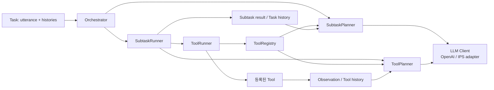

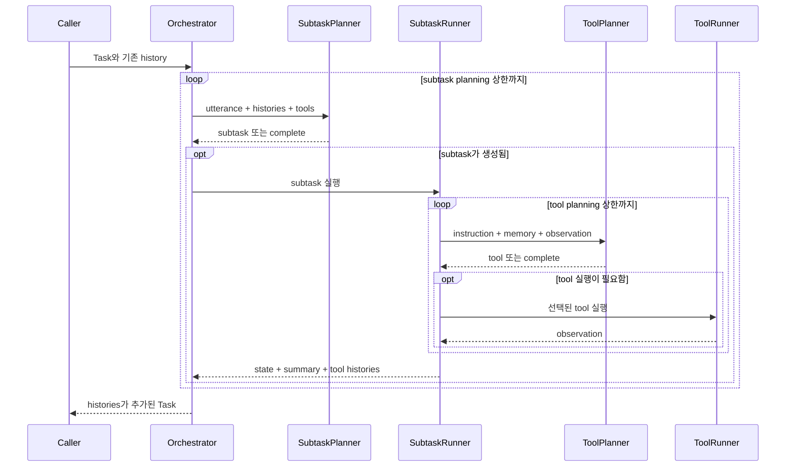

**평가에 미친 영향:** 실행 결과가 이미 여러 판단과 도구 호출로 이루어진다. 현재 AES의 Path/Step 평가와 문제의식은 이어지지만, 현재 evaluator가 이 초기 클래스를 그대로 옮겨 왔다는 증거는 없다. 당시 현재 형태의 AES도 존재하지 않았다.

## Phase 2 — Deep Agents와 외부 계약의 등장

**기간:** 2026-04-10 ~ 05-07.

대표 근거: `8e470a79` Deep Agents 도입, `074914a8` tool calling, `5afba726` skills, `7cdab641` agent registry. `8e470a79`는 기존 Orchestrator/SubtaskPlanner/ToolPlanner를 삭제하고 AgentAdapter와 DeepAgentAdapter를 추가한다.

반복 실행을 Deep Agents runtime에 맡기고, 서비스는 Adapter를 통해 메시지와 stream을 외부 계약으로 바꾼다. 4월 중순의 계약에는 `completed`, `isDone`, `messages`, `toolCalls`가 있다. 따라서 이벤트 이름이 `completed`여도 `isDone: false`이면 외부 도구 결과를 기다리는 상태다. 아래 그림은 4월 중순 이후 대표 흐름이다.

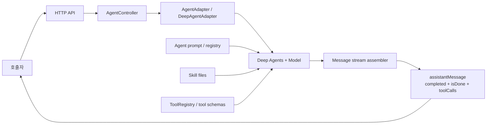

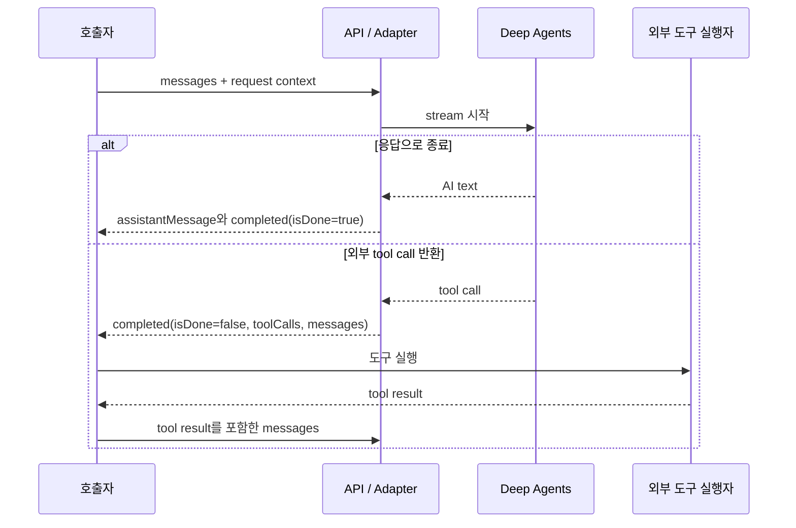

**평가에 미친 영향:** 내부 class 호출보다 서비스의 messages/tool-call 계약이 안정적인 평가 경계가 된다. 이후 SSE client와 output adapter가 필요한 배경이다. 단, 현재 AES의 SSE parser가 이 초기 `completed/isDone` 계약까지 지원하는 것은 아니다. 현재 parser는 `type: result` terminal event를 요구한다.

## Phase 3 — Fast 우선, 실패하면 내부에서 Deep으로 전환

**기간:** 2026-05-08 ~ 05-20.

대표 근거: `468426c6` planner/responder 분리, `74485351` FastPlanner, `a2e40ae6` planner/responder 통합. 아래 그림은 **05-08의 도입 시점**을 나타낸다. DisplayTextResponder 등 세부 구성은 이 기간 안에서도 바뀐다.

FastPlanner가 tool interrupt를 반환하면 바로 호출자에게 넘긴다. Fast가 structured status `completed`를 반환하면 응답을 생성하고, 실패 상태 또는 예외이면 Adapter가 같은 요청 안에서 DeepPlanner를 호출한다.

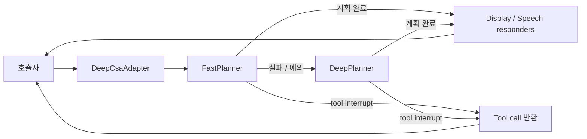

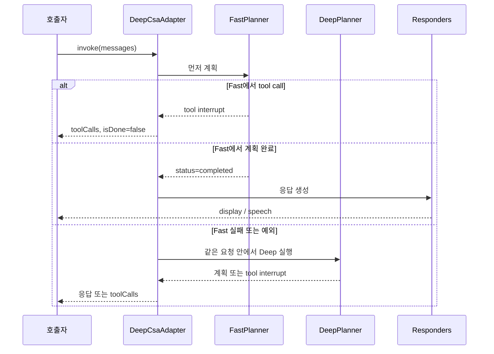

**평가에 미친 영향:** ‘어떤 행동을 선택했는가’ 외에 ‘Fast에서 처리할 수 있었는가, Deep으로 넘겼는가’가 평가 대상이 된다. AES도 05-12부터 별도 저장소에서 SSE replay, routing-correctness, Langfuse score push를 갖추기 시작했다. 따라서 AES가 8월에 처음 생긴 것은 아니다.

## Phase 4 — client가 이어 호출하는 프로토콜로 전환

**기간:** 2026-05-21 ~ 06-15.

가장 큰 경계 변화는 `6d8bb75d`다. 커밋 설명도 내부 fast/deep escalation에서 client가 `deliberate`로 tier를 구분해 호출하는 방식으로 바꾼다고 명시한다. 응답은 `completed/isDone`에서 `result/status`로 바뀌며, `completed | incompleted`와 `retryHints`를 사용한다.

이 기간에는 A2A 연동, progressive stream, Controller/ToolCallHandler 분리, internal tool 실행도 추가된다. `10c2b1fc`의 ToolRunner는 BOS 소유 도구를 직접 실행하지 않고, internal/A2A 도구는 AIC에서 실행한다. 아래 sequence의 escalation은 05-21 계약 기준이다. 06-04에는 재시도 표식을 messages에 두는 변경도 들어간다.

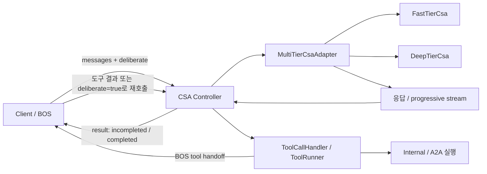

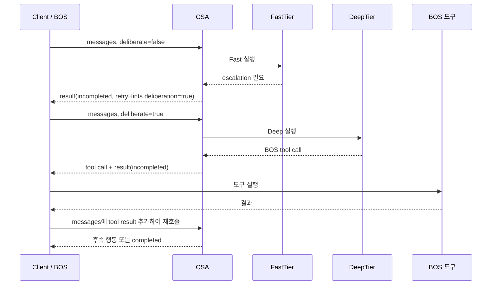

**평가에 미친 영향:** 사용자 발화 한 번(Turn), 평가하는 행동 한 단계(Step), HTTP 요청 한 번이 서로 다른 단위가 된다. AES에 multi-step fixture와 재생 요청 생성이 필요한 배경이다. `tier` 채점은 현재 구현상 escalation 여부 비교이고, 모든 실제 model route를 완전히 추적하는 지표는 아니다.

## Phase 5 — 로컬 skill 중심에서 CDS discovery 중심으로

**기간:** 2026-06-16 ~ 07-05.

대표 근거: `f1f63595` DeepTier CDS search, `810568b2` FastTier CDS, `c8304dca` 확장 CDS resource, `52801454` ToolSpec/ToolRunnable, `0162aa27` callDeviceAgent 이름 변경.

Fast에는 discovery middleware가 후보를 주입하고, Deep에는 필요할 때 CDS를 검색하는 도구가 들어온다. 06-16 커밋은 기존 Fast/Deep의 skill file 주입을 제거한다고 명시한다. 이는 이후 로컬 CDS fallback 지원까지 사라졌다는 뜻은 아니다.

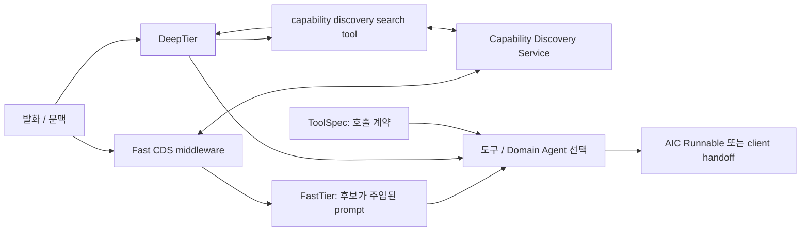

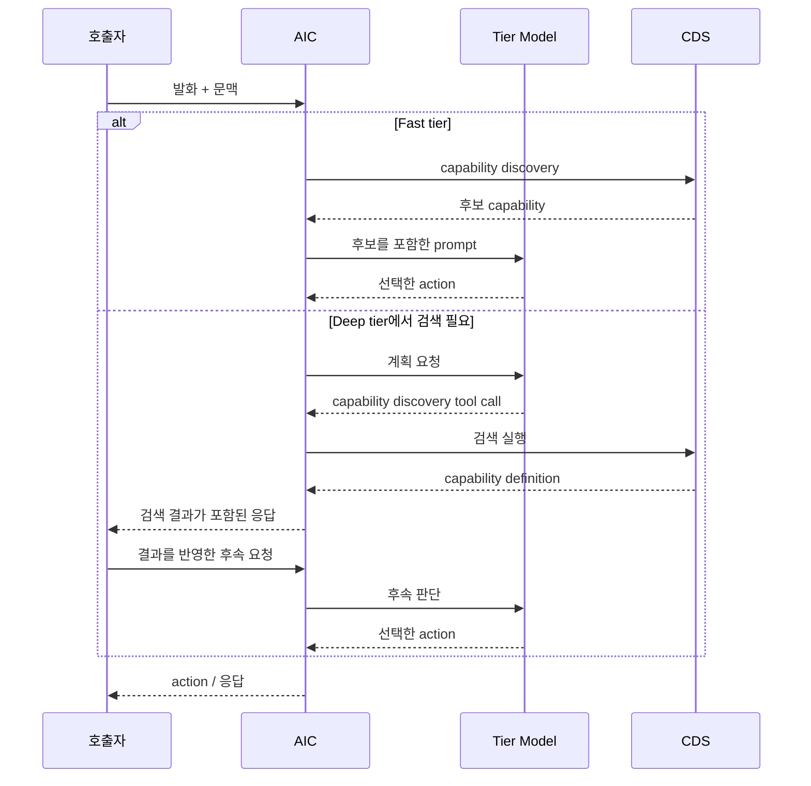

**평가에 미친 영향:** 잘못된 action의 원인이 ‘CDS가 필요한 후보를 못 찾음’인지 ‘후보는 있었지만 CSA가 잘못 선택함’인지 나누어야 한다. 현재 AES의 `cds_expected`와 discovery failure 분류가 다루는 구분이다. 이 분류기가 6월에 이미 존재했다는 뜻은 아니다.

## Phase 6 — snapshot과 capability fetch로 재개 가능한 상태 전달

**기간:** 2026-07-06 ~ 08-10.

대표 근거: `4e5c1fea` SnapshotStore, `f6896738` fetchCapability, `38d78010` fetchFastCapability, `62f0993e` debug stream, `562c6020` Deep CDS debug, `6545c058` capability hierarchy.

messages만으로 표현되지 않는 runtime 상태를 snapshot으로 호출자에게 내보내고 다시 복원한다. 도입 시점부터 `incompleted`에는 전체 상태를, `completed`에는 persistent namespace 상태만 유지하는 수명 구분이 있다. 동시에 skill 이름의 발견과 실제 본문의 로드가 다른 단계가 되고, CDS 결과에는 skills/domain agents/tools/subagents/A2A 같은 구분이 생긴다.

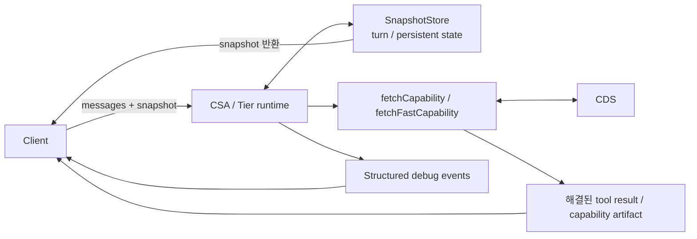

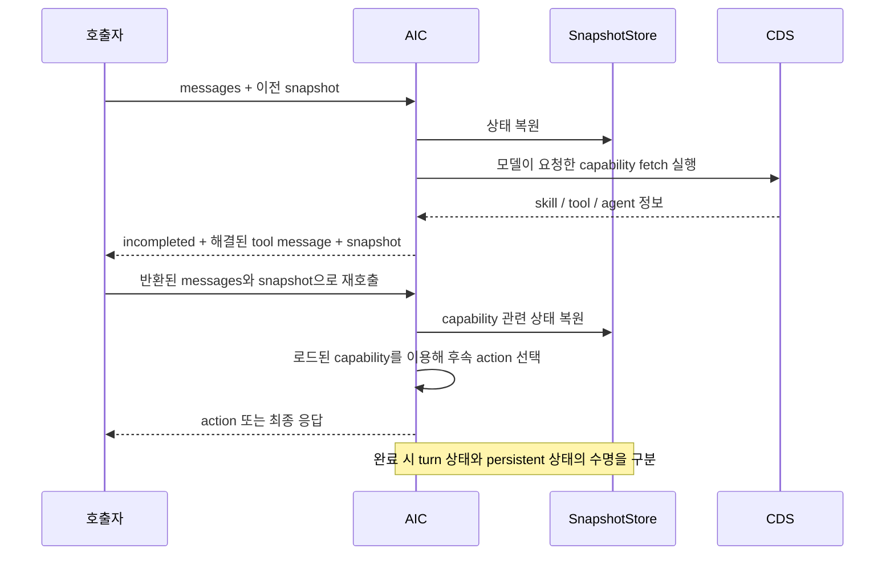

**평가에 미친 영향:** 기대 action 앞에 capability fetch라는 내부 절차가 들어갈 수 있다. fetch를 곧바로 오답 action으로 보면 올바른 후속 행동을 놓친다. 반대로 fetch를 요청했다는 사실만으로 skill을 읽었다고 판단하면 실제 로드 실패를 놓친다. AES의 continuation과 skill evidence가 필요한 배경이다.

이 snapshot은 **AIC의 대화/runtime 상태**다. AES의 checkpoint는 **평가 배치의 완료 결과**를 저장한다. 두 상태는 목적과 저장 단위가 다르다.

## Phase 7 — 현재 경계: AIC는 runtime, AES는 계약 기반 평가

**기간:** 2026-08-11 ~ 08-31. AES는 08-27 checkout 기준.

직접적인 근거와 순서는 다음과 같다.

1. **AIC `3005d3d3`, 08-11:** LLM·환경 의존 평가 runner와 dataset 제거. “Evaluations will be managed in AES”라고 명시한다. 기존 AES로 평가 책임을 모으는 변경이다.
2. **AIC `76cafb3c`, 08-12:** escalation을 일반 built-in tool의 `artifact.retryHints`로 바꿈. Controller는 호출자가 결과를 돌려주는 **다음 invoke 진입 시** 이를 처리한다.
3. **AIC `44def33e`, 08-13 / `2b77f6a6`, 08-19:** CDS 결과 수집과 소비를 정리하고 DynamicCapabilitiesMiddleware에서 prompt와 bound tools를 구성한다. tool content에는 manifest를, artifact에는 구조화된 결과를 둔다.
4. **AIC `6bb94265`, 08-14:** escalation 이후 대화의 deliberate 상태를 persistent snapshot에 유지한다.
5. **AES `ac430cb02b` ~ `abd6eafd67`, 08-19~22:** unified schema, validator, preflight, HTTP client, execution budget, deterministic scorer, executor/CLI를 순차 도입한다.
6. **AES `cbf80e2527`, 08-25 / `7499d0c372`, 08-26:** skill 채점과 remote capability continuation을 도입한다. 후자에서 AES의 로컬 skill 실행기를 제거한다.
7. **AES `5da87bdf9f` / `68093a5e2b`, 08-27:** checkpoint/resume와 등록된 bixby4-agents schema 로딩을 추가한다.
8. **AIC `fcd56240`, 08-26:** callDeviceAgent built-in 구현을 제거하고 request ID 관리를 BOS로 모은다.
9. **AIC `b2dc4d18`, 08-28:** gRPC 추가. 제목은 migration이지만 현재 `server/main.ts`는 HTTP와 gRPC를 함께 시작한다.

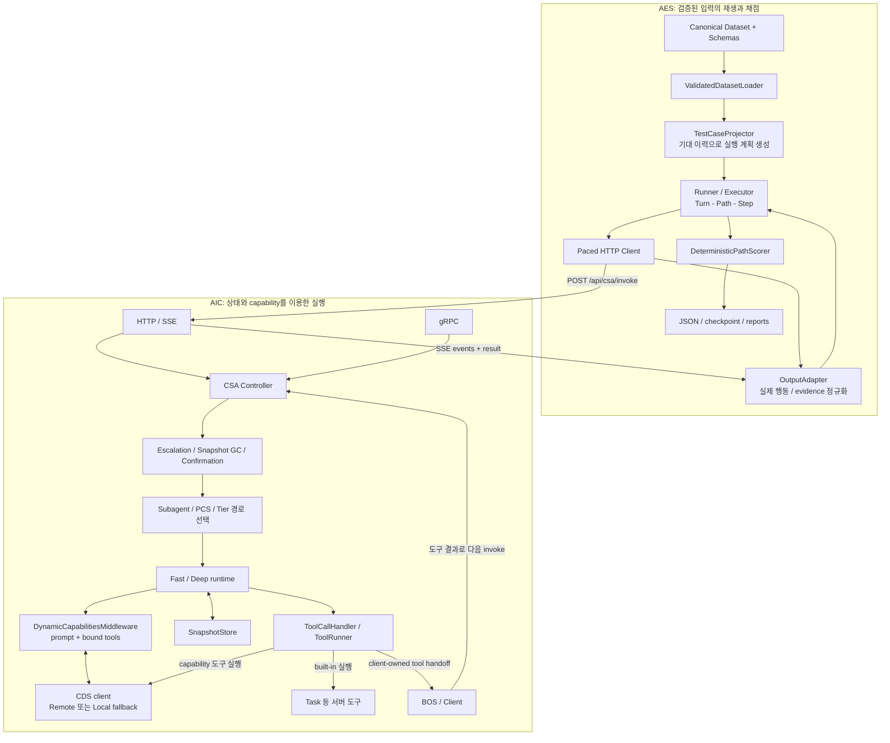

이 블록도는 책임 경계를 보여준다. Controller의 실제 조건 순서는 escalation·snapshot 정리 → confirmation → subagent continuation → PCS → 일반 tier 경로다. speech/view/progressive responder와 tracing은 가독성을 위해 생략했다. CDS의 remote/local 선택은 AIC 설정에 속하며, AES가 직접 CDS 구현을 선택하거나 skill 파일을 실행하는 구조가 아니다.

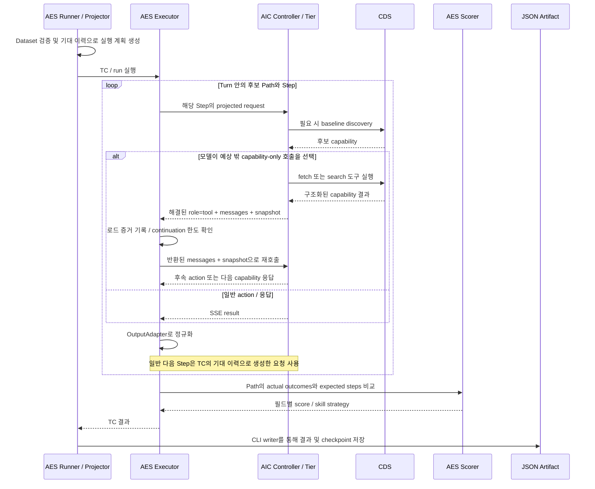

이 sequence는 한 후보 Path의 채점을 중심으로 단순화했다. 실제 executor는 Path별로 채점하고, Turn 안에서 하나가 맞거나 AIC 오류가 발생하면 다른 Path 시도를 멈춘다. 모든 Turn이 맞아야 TC가 맞는다. capability continuation은 한 번으로 고정되지 않고 설정 상한 내에서 반복된다.

## 왜 현재 evaluator가 이 모듈들로 나뉘었는가

| 현재 AES 구성 | 대응하는 AIC 특성 / 평가 요구 | 코드상 의미와 범위 |
| --- | --- | --- |
| SchemaRegistry / Validator / Loader | 도구·device·context 계약의 확대 | 잘못된 fixture를 AIC 품질 실패로 혼동하지 않도록 preflight. 정책상 허용된 유효 TC만 선택 |
| TestCaseProjector | AIC는 messages와 context를 입력으로 받음 | canonical TC를 AIC payload로 변환하고 기대 tool output을 history에 넣음 |
| Turn / Path / Step executor | 한 발화에서 여러 호출, 여러 허용 경로 가능 | 경로별 판정. 실제 응답을 끝까지 자유롭게 이어 가는 대화 엔진은 아님 |
| HTTP/SSE Client | text·progress·tool·debug·result가 섞인 stream | terminal result와 전체 events를 분리해서 해석 |
| CompatibleAicOutputAdapter | tool call 표현 위치와 escalation 표현의 변화 | result.toolCalls → 새 messages의 toolCalls → toolCall event 순서로 읽음 |
| Capability continuation | fetch/search 뒤 후속 행동이 별도 invoke에 올 수 있음 | 예상 밖 capability-only 응답에 한해 실제 messages/snapshot으로 이어 호출 |
| DeterministicPathScorer | 행동 선택과 skill/tier 결과를 재현 가능하게 비교 | 설정된 action/tool/tier/skill 필드, 조건부 NLG exact 비교 |
| Discovery failure classifier | 후보 검색과 최종 선택은 별도 단계 | 구조화된 증거로 CDS-fail / gbfs-fail / CSA-fail 등을 분류 |
| Rate limit / concurrency / repetitions | 원격 runtime 반복 평가 | 호출 시작 간격과 동시 실행을 제한. 특정 AIC 커밋에 강제된 것은 아닌 평가 운영 설계 |
| Checkpoint / provenance / report | 장시간 배치와 버전별 비교 | 계획 digest·실행 조건·소스 revision을 확인하고 완료 결과 재사용, artifact로 재보고 |

## 해석할 때 지켜야 할 경계

### 1. 현재 AES는 golden-history 기반 평가다

`TestCaseProjector.appendExpectedStep()`이 **expected tool call/result**를 다음 step의 입력 이력에 넣는다. `project()`의 다음 Turn 이력도 primary expected path에서 생성한다. Executor는 각 Step의 미리 만들어진 요청을 실행한다.

따라서 이 평가는 ‘정해진 문맥에서 올바른 다음 행동을 선택하는가’를 본다. 앞 단계의 실제 잘못된 출력을 계속 먹였을 때 전체 업무가 성공하는지, 실제 BOS·기기가 작업을 완료했는지를 모두 검증하는 폐루프 E2E 평가와는 범위가 다르다. 이 구조가 오류 전파를 분리해 단계별 판단을 보기 좋게 만든다는 것은 코드에 근거한 해석이다.

### 2. Capability continuation은 제한적인 실제 상태 재개다

`fetchCapability`, `fetchFastCapability`, `capabilityDiscoverySearch`만 대상이며, TC가 이 도구를 명시적으로 기대하면 일반 채점 대상으로 취급한다. TC가 다른 행동을 기대하는데 capability-only 응답이 오면, 성공한 대응 tool message를 확인하고 messages/snapshot을 이어 보낸다. 기본 최대 continuation은 expected Step마다 3회다.

capability와 다른 action이 섞인 응답, tool 결과 누락/실패, 상한 초과는 오류로 기록한다. 일반 다른 action은 자동 재시도하지 않는다. 서버가 실행한 모든 built-in tool을 AES가 자동으로 이어 주는 것도 아니다.

### 3. Skill 요청, 로드, 행동 성공은 각각 다르다

실제 로드는 반환된 tool artifact의 `cdsResults.skills`에서 name과 content를 확인한다. 요청한 이름만으로 로드를 인정하지 않는다. 기본 action 평가에서는 기대 action을 바로 선택한 경우도 통과할 수 있다. skill 사용까지 요구하려면 `skill` match field가 필요하다.

### 4. Deterministic은 판단 규칙을 뜻한다

LLM 자체의 출력을 결정적으로 만드는 것이 아니다. 일반 action argument 비교에서는 `message`, `query`, `referenceRequestId`를 정규화 과정에서 제외한다. 명시적으로 기대하는 capability 도구는 전체 parameters를 exact match한다. 따라서 ‘모든 parameter의 무조건 완전일치’라고 표현하면 부정확하다.

### 5. 원인 분류는 증거가 있을 때만 한다

CDS 후보에 기대 agent가 없으면 CDS-fail, agent는 있지만 기대 function이 없으면 gbfs-fail, 필요한 후보가 있는데 action이 틀리면 CSA-fail로 분류한다. 증거가 부족하면 unverifiable이다. 이것은 AES 분류 규칙이며 CDS 서버 내부 구현을 직접 추적해서 입증한 인과관계는 아니다.

### 6. Schema와 transport의 범위를 과장하지 않는다

현재 외부 bixby4-agents loader에는 startTimer, getRemainingTimerTime, findTimers의 3개 function schema가 등록되어 있다. 모든 domain function을 자동으로 동기화한다고 볼 수 없다.

AIC는 현재 HTTP/SSE와 gRPC를 함께 제공하지만 AES는 HTTP/SSE client다. 또한 현재 output adapter의 호환성은 일부 응답 표현 차이에 대한 것이며 AIC의 2월~8월 모든 버전을 직접 평가할 수 있다는 뜻이 아니다.

## 소스 근거

소스 링크는 분석에 사용한 커밋에 고정되어 있으며, 해당 GitHub Enterprise 저장소의 접근 권한이 필요하다.

### AIC 현재 구현

- [HTTP와 gRPC 동시 시작](https://github.ecodesamsung.com/bixby-platform/agentic-intelligence-core/blob/fde590ecc4e56fe1c04d58ee538f28ddcba137be/server/main.ts#L9)
- [Controller의 준비·분기·도구 실행 결과 수집](https://github.ecodesamsung.com/bixby-platform/agentic-intelligence-core/blob/fde590ecc4e56fe1c04d58ee538f28ddcba137be/core/csa/cognitive-supervisor-agent-controller.ts#L76)
- [Fast/Deep 선택과 snapshot 복원](https://github.ecodesamsung.com/bixby-platform/agentic-intelligence-core/blob/fde590ecc4e56fe1c04d58ee538f28ddcba137be/deepagents/multi-tier-csa-adapter.ts#L71)
- [Dynamic capability 수집·prompt·tool binding](https://github.ecodesamsung.com/bixby-platform/agentic-intelligence-core/blob/fde590ecc4e56fe1c04d58ee538f28ddcba137be/deepagents/middlewares/dynamic-capabilities-middleware.ts#L82)
- [Retry hints와 지속되는 deliberate 상태](https://github.ecodesamsung.com/bixby-platform/agentic-intelligence-core/blob/fde590ecc4e56fe1c04d58ee538f28ddcba137be/core/csa/escalation.ts#L56)
- [Capability fetch의 구조화된 tool result](https://github.ecodesamsung.com/bixby-platform/agentic-intelligence-core/blob/fde590ecc4e56fe1c04d58ee538f28ddcba137be/tools/cds/fetch-capability-tool.ts)

### AES 현재 구현

- [Golden history와 projection](https://github.ecodesamsung.com/bixby-platform/agentic-evaluation-service/blob/68093a5e2b0e498ca62d56e3fe10db51ded026fc/evaluator/projection/test-case-projector.ts#L127)
- [Path/Step 실행과 continuation](https://github.ecodesamsung.com/bixby-platform/agentic-evaluation-service/blob/68093a5e2b0e498ca62d56e3fe10db51ded026fc/evaluator/execution/aic-test-case-executor.ts#L90)
- [응답 호환 처리](https://github.ecodesamsung.com/bixby-platform/agentic-evaluation-service/blob/68093a5e2b0e498ca62d56e3fe10db51ded026fc/evaluator/execution/aic/aic-output-adapter.ts)
- [Terminal result 파싱](https://github.ecodesamsung.com/bixby-platform/agentic-evaluation-service/blob/68093a5e2b0e498ca62d56e3fe10db51ded026fc/evaluator/execution/aic/aic-sse-response.ts#L37)
- [Deterministic scorer](https://github.ecodesamsung.com/bixby-platform/agentic-evaluation-service/blob/68093a5e2b0e498ca62d56e3fe10db51ded026fc/evaluator/scoring/deterministic-path-scorer.ts#L113)
- [Discovery 실패 분류](https://github.ecodesamsung.com/bixby-platform/agentic-evaluation-service/blob/68093a5e2b0e498ca62d56e3fe10db51ded026fc/evaluator/analysis/discovery-failure-classifier.ts)
- [등록된 외부 function schema](https://github.ecodesamsung.com/bixby-platform/agentic-evaluation-service/blob/68093a5e2b0e498ca62d56e3fe10db51ded026fc/validator/schema/bixby4-agent-schema-loader.ts#L32)

### 과거 구현 재확인

과거 파일은 현재 작업 트리를 checkout하지 않고 `git show`로 읽었다. 아래 명령은 두 저장소가 있는 상위 디렉터리에서 실행한다:

```bash
git -C agentic-intelligence-core show a2008ec3:core/orchestrator/orchestrator.ts
git -C agentic-intelligence-core show 74485351:deepagents/deep-csa-adapter.ts
git -C agentic-intelligence-core show 6d8bb75d:deepagents/multi-tier-csa-adapter.ts
git -C agentic-intelligence-core show 3005d3d3
git -C agentic-evaluation-service show 7499d0c372
```

문서 작성 중 runtime 코드와 데이터셋은 변경하지 않았으며, AIC 또는 CDS로 평가 요청을 보내지 않았다.
