# Agentic Intelligence Core: 초기부터 현재까지의 아키텍처 변화

기준: 원본 `agentic-intelligence-core` 저장소의 HEAD `fde590ecc4e56fe1c04d58ee538f28ddcba137be` (2026-08-31). 해당 HEAD에서 도달 가능한 523개 커밋의 이력에서 주요 변경을 고르고, 해당 시점의 소스와 diff로 구조를 확인했다. 아래 phase는 저장소의 공식 릴리스 이름이 아니라 구조 변화를 설명하기 위해 나눈 구간이다. 각 그림은 해당 단계의 주요 경로를 간추렸으며 운영 배포 토폴로지를 의미하지 않는다.

## 시작점 — 서버 골격 (2026-02-19)

첫 커밋 `cc18f64a`에는 README와 gitignore만 있다. 다음 `359b3437`에서 Hono 서버, 로깅, 환경 설정 등의 골격이 생긴다. 이 시점에는 실제 에이전트 요청 경로가 아직 없다.

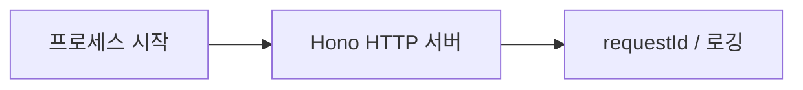

## Phase 1 — 직접 작성한 계층형 계획·실행 루프 (2월 19일–3월)

대표 스냅샷: `a2008ec3` (3월 3일). `Orchestrator`가 하위 작업을 선택하고, `SubtaskRunner`가 그 작업에 필요한 도구를 선택·실행한다. 상위 루프와 하위 루프 모두 실행 결과를 다음 계획에 반영한다. 아래 입력은 코드 호출자이며, 당시 Hono 서버에 이 흐름이 완성된 API로 연결되어 있었다는 뜻은 아니다.

**시스템**

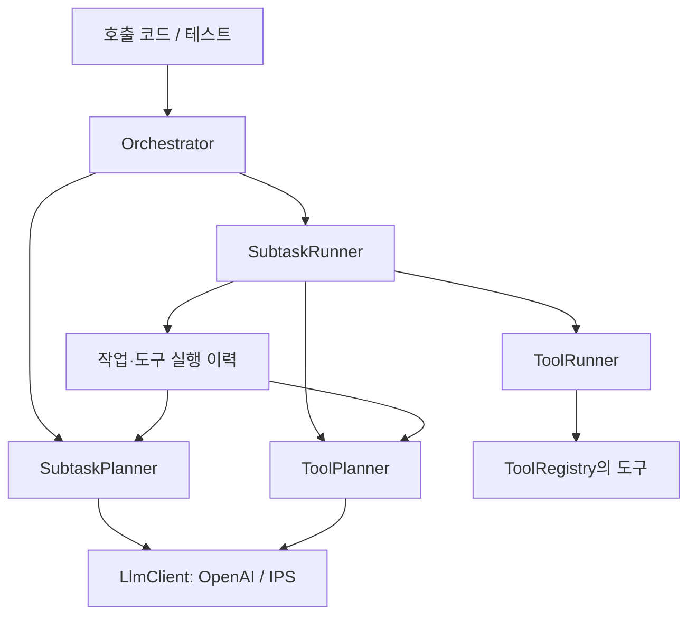

**시퀀스**

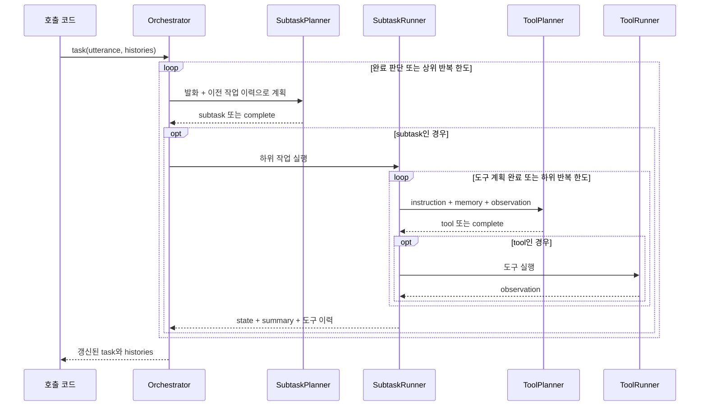

이 단계의 핵심은 **계획과 실행 반복을 애플리케이션 코드가 직접 제어한다**는 점이다. 3월 19일 `f9559ed3`에 gRPC 골격도 추가되지만, DeepPlanner 핸들러는 요청 로깅만 수행한다. 이를 현재 CSA gRPC 구현과 같은 완성도로 해석하면 안 된다.

## Phase 2 — Deep Agents 런타임으로 교체 (4월 10일–말)

`8e470a79`에서 기존 Orchestrator·SubtaskPlanner·ToolPlanner를 제거하고 `AgentController → AgentAdapter → DeepAgentAdapter`로 교체한다. 처음에는 기본 프롬프트와 빈 도구 목록으로 시작한다. 4월 14일 도구 호출, 15일 도구·스킬·에이전트 레지스트리, 20일 DI 부트스트랩이 추가된다.

**시스템 — 4월 중순 이후 구성 요약**

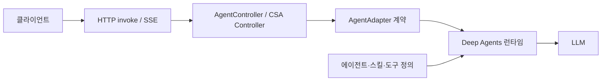

**시퀀스 — 4월 10일 기본 텍스트 스트리밍 경로**

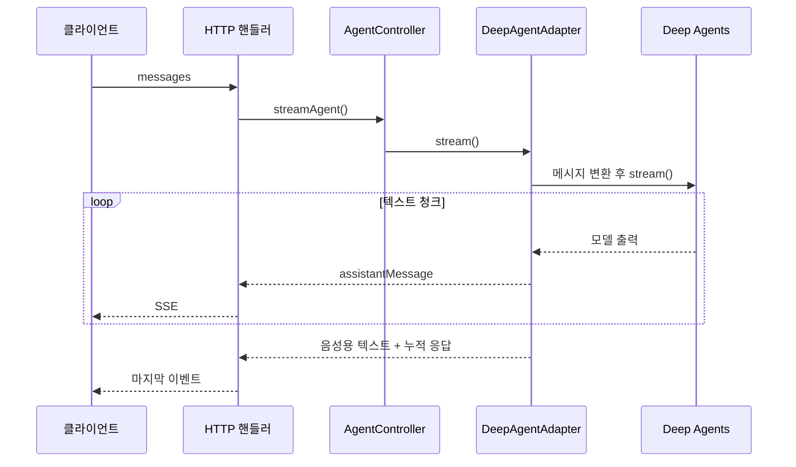

직접 작성하던 계획 루프를 런타임에 맡기고, 서비스의 입출력은 Adapter 계약으로 감싼다. 초기 gRPC 골격은 같은 날 `b1f1604e`에서 제거된다.

## Phase 3 — Fast 먼저, 실패하면 서버 내부에서 Deep (5월 8일)

`468426c6`에서 DeepPlanner와 DisplayTextResponder를 분리하고, `74485351`에서 FastPlanner를 앞에 추가한다. 이때는 Fast가 실패 상태를 반환하거나 예외를 던지면 **같은 요청 안에서 Adapter가 Deep을 호출**한다. Fast가 도구 호출로 중단되면 해당 도구 호출을 반환하고 그 요청을 끝낸다.

**시스템**

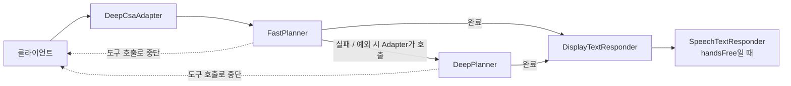

**시퀀스 — 도구 중단이 없는 경로**

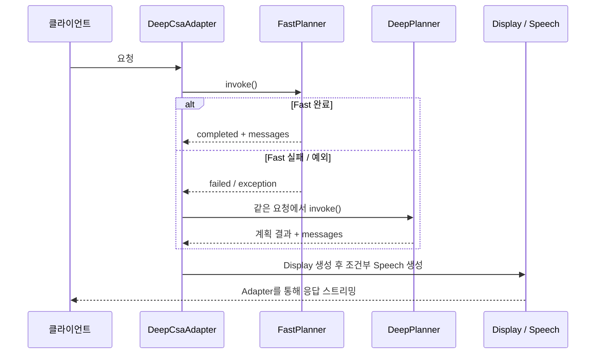

변화의 목적은 간단한 요청을 Fast가 처리하게 하고, 복잡한 경우 Deep을 사용하도록 실행 경로를 나누는 것이다. 현재의 승격 방식과는 호출 경계가 다르다.

## Phase 4 — 두 계층과 클라이언트 재요청 계약 (5월 12일–6월 초)

5월 12일 `a2e40ae6`에서 planner와 display responder를 통합한다. 20일 `42959317`에서 CSA Controller의 ToolRunner 처리를 추가하고, 21일 `6d8bb75d`에서 `MultiTierCsaAdapter`, `FastTierCsa`, `DeepTierCsa`, `deliberate` 입력과 `result.status` 계약을 정리한다.

**시스템**

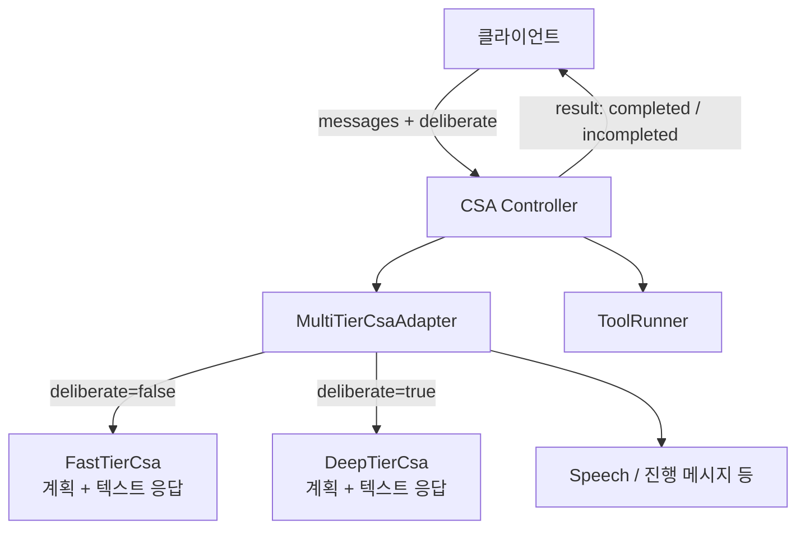

**시퀀스 — 5월 21일 승격 계약**

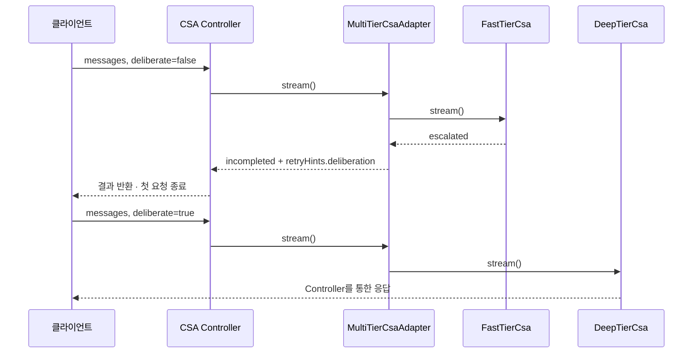

핵심 변화는 **한 사용자 턴이 여러 API 요청으로 이어질 수 있게 계약을 명시한 것**이다. 여기서 `retryHints`는 당시의 최상위 결과 필드다. 현재의 도구 결과 artifact 방식은 Phase 7에서 도입된다. 이 시점에는 아직 `SnapshotStore` 요청 계약을 그리지 않는다.

5월 말에는 A2A로 DQA/OpenQA를 호출하는 내장 도구, Langfuse 추적, 진행 응답 병렬 처리가 추가된다. 6월 초에는 메시지·오류 처리가 Controller로 이동하고 `ToolCallHandler`가 분리된다.

## Phase 5 — CDS 기능 탐색과 PCS 캐시 (6월 중순–말)

6월 16일 `f1f63595`, `810568b2`에서 Deep/Fast에 CDS를 도입하고, 22일 `e12facb0`에서 Controller 앞단의 PCS 캐시 경로를 추가한다. CDS는 사용할 기능을 찾고, PCS는 사용할 수 있는 캐시 결과로 CSA 추론 호출을 생략하게 한다. 둘의 역할과 호출 위치가 다르다.

**시스템**

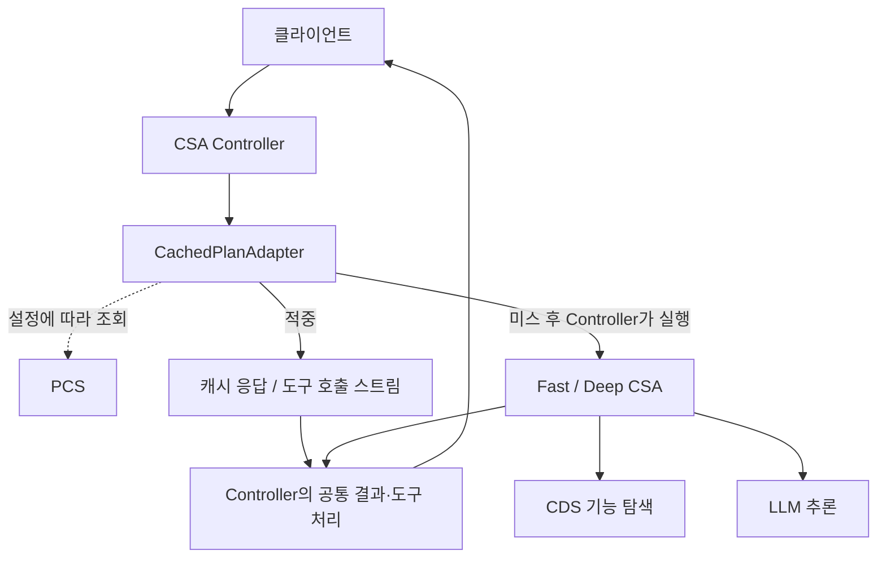

**시퀀스 — 대표 일반 경로**

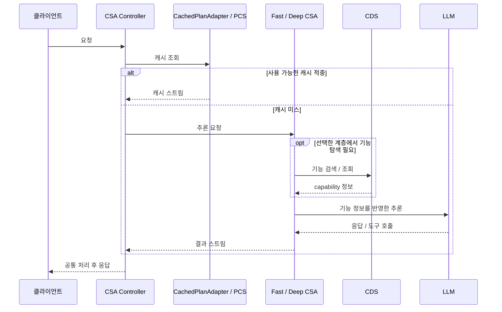

CDS 조회는 계층에 따라 미들웨어 또는 도구 실행을 통해 수행되므로 그림은 논리적 의존을 나타낸다. 모든 요청에서 정확히 한 번씩 LLM 전에 호출한다는 의미는 아니다. 6월 25일 `4d3d5fed`의 workspace 서브에이전트 정의 지원도 다음 단계의 기반이 된다.

## Phase 6 — 상태를 가지고 중단·재개하는 실행 (7월)

7월 6일 `4e5c1fea`에서 `SnapshotStore`, 13일 `351f173d`에서 서브에이전트 dispatch와 재개 경로, 27일 `7b73911e`에서 공유 메모리 체크포인터, 31일 `aef14667`에서 ConfirmationDispatch/Coordinator가 들어온다. 확인 미들웨어 자체는 5월부터 있었으며, 7월의 변화는 명시적인 확인 상태·분기 구조다.

**시스템**

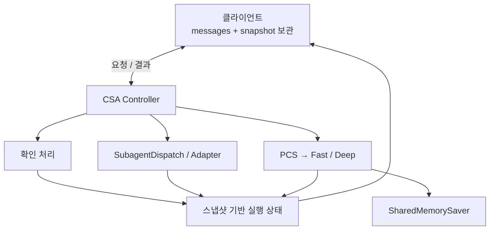

**시퀀스 — 스냅샷 왕복의 대표 경로**

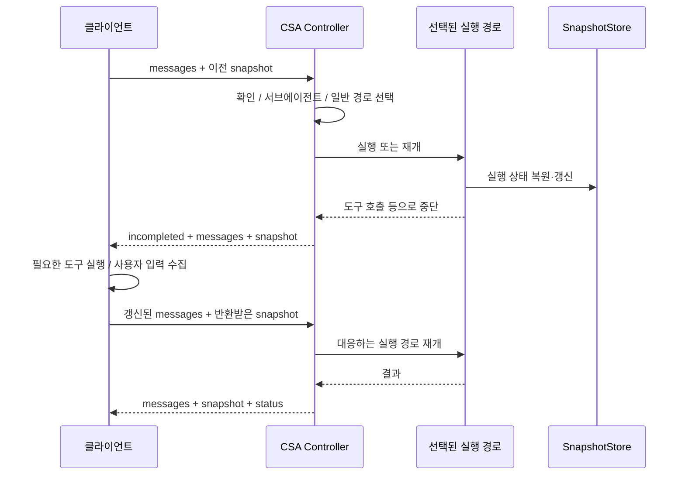

그림의 SnapshotStore는 런타임 내부 상태를 단순화한 표현이며 모든 분기에서 동일한 메서드를 직접 호출한다는 의미는 아니다. 체크포인터가 이전에도 없었던 것은 아니다. 이 시기에 요청 간 스냅샷 계약과 공유 체크포인터 구현을 구분해 정리한 것이다. 두 저장소 모두 별도 영속 DB를 의미하지 않는다.

## Phase 7 — 현재: 공통 Controller로 통합된 실행 흐름 (8월–8월 31일 HEAD)

8월에는 새로운 계층을 늘리는 것과 함께 상태 수명과 책임 경계를 정리한다.

- 8월 12일 `30c4f98f`: 메시지와 연계한 snapshot GC.
- 8월 12일 `76cafb3c`: 도구 결과 artifact의 `retryHints.deliberation`을 Controller에서 해석.
- 8월 14일 `6bb94265`: 한 번 승격한 대화는 이후에도 deliberate 상태 유지.
- 8월 18일 `f0d42184`: 클라이언트 도구 왕복을 하나의 Langfuse trace로 연결.
- 8월 19일 `e51ba1b7`: 내장 A2A 도구 구현 제거.
- 8월 26일 `fcd56240`: 내장 callDeviceAgent 구현 제거. 도구 이름이나 동적 도구 계약 자체가 사라졌다는 뜻은 아니다.
- 8월 28일 `b2dc4d18`: 현재 CSA 계약의 gRPC 서버 스트리밍 추가. 커밋 제목은 migrate이지만 현재 `server/main.ts`는 HTTP와 gRPC를 함께 시작한다.

**시스템 — 현재 주요 구성**

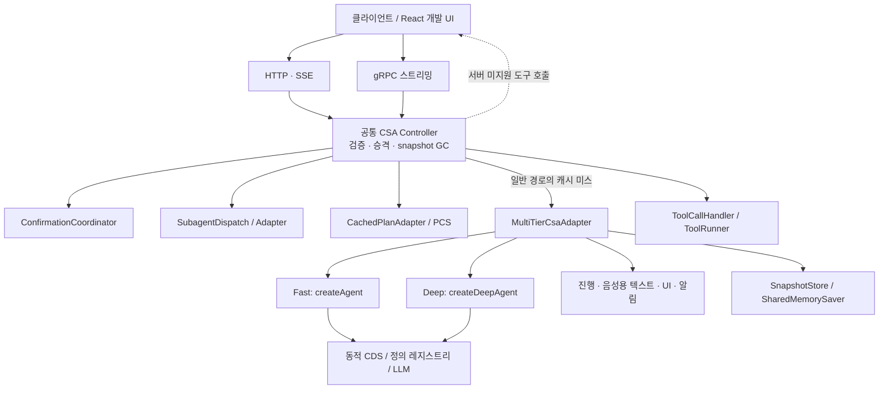

**시퀀스 — 현재 Controller의 분기 순서**

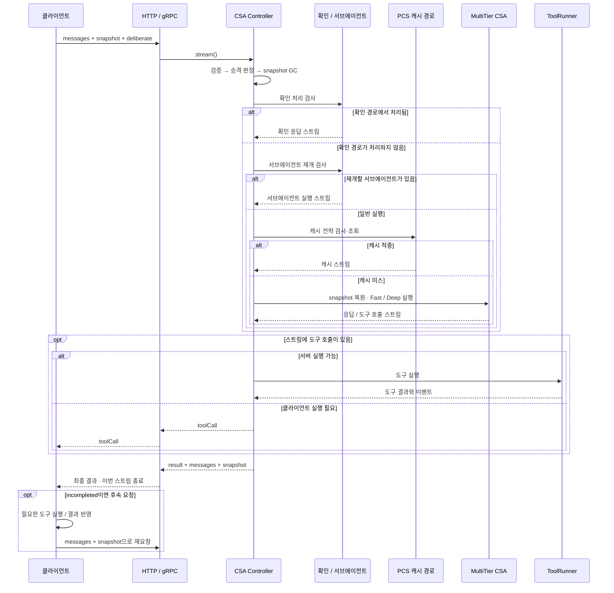

응답 이벤트는 실행 중에도 계속 전달된다. 마지막 그림은 Controller 분기 순서를 읽기 쉽게 하기 위해 텍스트·진행·음성·알림 등의 중간 이벤트를 생략했다. 도구 재요청은 Phase 6의 스냅샷 왕복 흐름과 함께 읽으면 된다.

## 이력을 다시 확인하는 방법

각 phase의 커밋 ID와 코드 경로는 포트폴리오가 아닌 원본 `agentic-intelligence-core` 저장소를 기준으로 한다. 원본 저장소에 접근 가능한 환경에서 다음 명령으로 해당 시점의 구현을 확인할 수 있다.

```bash
git show a2008ec3:core/orchestrator/orchestrator.ts
git show a2008ec3:core/subtask/subtask-runner.ts
git show 8e470a79:deepagents/deep-agent-adapter.ts
git show 74485351:deepagents/deep-csa-adapter.ts
git show 6d8bb75d:deepagents/multi-tier-csa-adapter.ts
git show e12facb0:core/csa/cognitive-supervisor-agent-controller.ts
git show 4e5c1fea:deepagents/store/snapshot-store.ts
git show 351f173d -- core/csa/subagent-dispatch.ts
git show aef14667 -- core/confirmation
git show b2dc4d18 -- server/main.ts
```

현재 근거: Controller (`core/csa/cognitive-supervisor-agent-controller.ts`), MultiTier Adapter (`deepagents/multi-tier-csa-adapter.ts`), 승격 처리 (`core/csa/escalation.ts`), 공통 서버 부트스트랩 (`server/main.ts`), 클라이언트 재요청 루프 (`web/src/App.tsx`).
